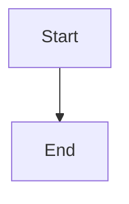
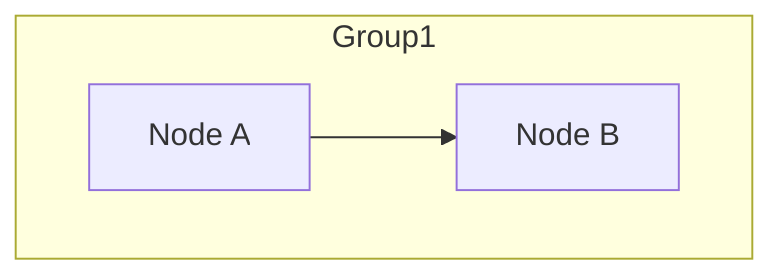
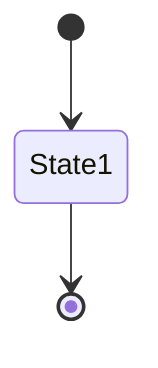
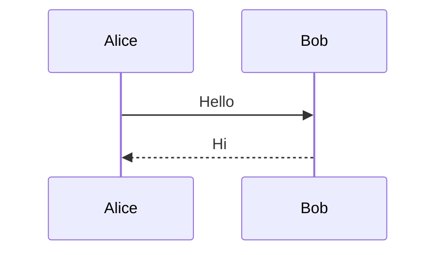

# Mermaid Test

## Test 1: Simple flowchart

```mermaid
flowchart TB
    A[Start] --> B[End]
```

## Test 2: With subgraph

```mermaid
flowchart TB
    subgraph Group1
        A[Node A]
        B[Node B]
    end
    A --> B
```

## Test 3: State diagram

```mermaid
stateDiagram-v2
    [*] --> State1
    State1 --> [*]
```

## Test 4: Sequence diagram

```mermaid
sequenceDiagram
    Alice->>Bob: Hello
    Bob-->>Alice: Hi
```
